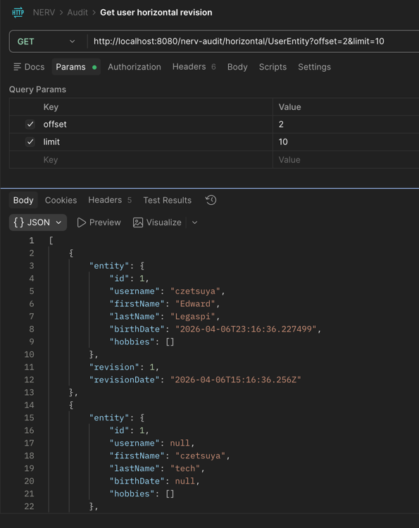
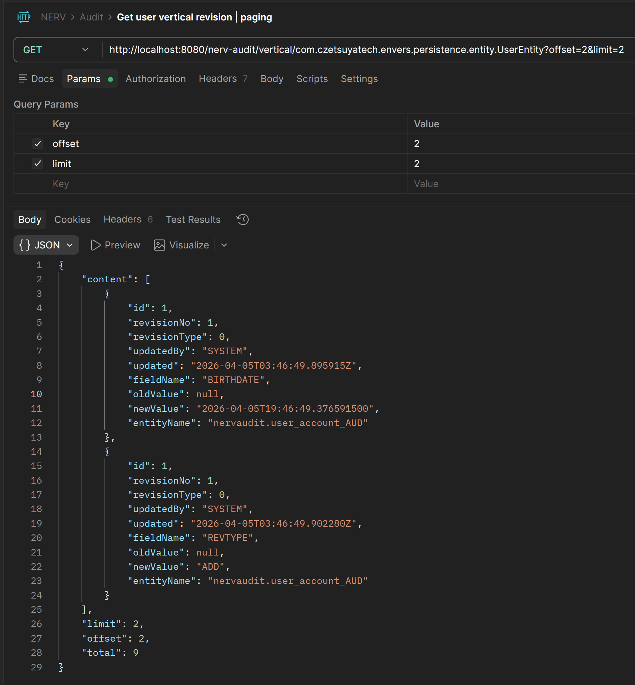
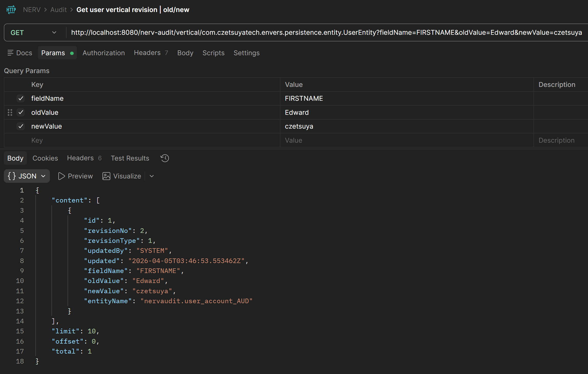

🚀 **Now available on Maven Central**  
Get started: https://www.czetsuyatech.com/2026/04/spring-boot-audit-trail-hibernate-envers.html

---

# NERV Audit

Production-oriented audit trail starter for Spring Boot applications, built on Hibernate Envers with
a clean API for querying historical changes.

Built by **Czetsuya Tech** for teams that want traceability, compliance support, and
developer-friendly integration without reinventing audit infrastructure.

## Why This Exists

Most teams need reliable change tracking, but building and maintaining audit tooling consumes time
better spent on product features.

`nerv-audit` gives you:

- Auto-configured Envers listener customization
- Extension points for custom audit-table resolution

## Editions

### Lite

- JPA `create` operation auditing
- Vertical or horizontal audit strategies
- Queryable audit controller/web endpoint for application-level audit browsing

### Pro

- JPA `create`, `update`, and `delete` operation auditing
- JPA auditing of a `list` property
- Vertical or horizontal audit strategies
- Queryable audit controller/web endpoint for application-level audit browsing

## Core Value for Clients

This project is also a showcase of how I deliver software services as an IT programmer:

- I design reusable, modular libraries (not one-off hacks)
- I ship maintainable Spring Boot infrastructure with clear extension points
- I focus on production concerns: observability, consistency, and operational simplicity
- I can turn internal platform utilities like this into product-grade components for your
  organization

## Modules

- `nerv-audit-api`: Core contracts, annotations, and DTOs for audit operations, including
  horizontal/vertical auditing models and service interfaces
- `nerv-audit-core`: Envers listeners, audit work units, query model, SQL builder,
  repository/service providing full vertical and horizontal entity versioning with audit querying
- `nerv-audit-lite`: Envers-based implementation providing simplified configuration, vertical and
  horizontal entity versioning, and basic audit querying
- `nerv-audit-spring-boot-starter`: Spring Boot auto-configuration and optional web endpoint

## Tech Stack

- Java `25`
- Maven multi-module build
- Spring Boot `4.0.4`
- Spring Data JPA
- Hibernate Envers

## Quick Start

### 1. Add dependency

If you publish this artifact to your internal/external Maven repository, add:

```xml

<dependencies>
  <dependency>
    <groupId>com.czetsuyatech</groupId>
    <artifactId>nerv-audit-spring-boot-starter</artifactId>
    <version>0.0.1-SNAPSHOT</version>
  </dependency>

  <dependency>
    <groupId>com.czetsuyatech</groupId>
    <artifactId>nerv-audit-core</artifactId>
    <version>0.0.1-SNAPSHOT</version>
  </dependency>
</dependencies>

```

### 2. Enable the web endpoint (Pro)

```yaml
nerv:
  audit:
    web:
      enabled: true
```

### 3. Configure behavior (optional)

```yaml
nerv:
  audit:
    audit-strategy-type: VERTICAL # VERTICAL (default) | HORIZONTAL
    audit-insert: false           # default false
    audit-fields: createdBy,created,updatedBy,updated,originalId,revisionType,version
```

Defaults are driven by `AuditConfig`:

- `auditStrategyType`: `VERTICAL`
- `auditInsert`: `false`
- `auditFields`: falls back to framework defaults if not set

### 4. Configure license (optional)

```yaml
nerv:
  audit:
    license:
      key:
      public-key: czetsuyatech_nerv_public.pem
      enabled: true
```

- `key`: customer's key which gives PRO access to users
- `public-key`: PEM-encoded public key for license verification/built-in
- `enabled`: `true` to enable license verification, `false` to disable

Default license runs with the LITE version.

## REST API

The REST API is available in **Pro**. When `nerv.audit.web.enabled=true`, the starter exposes:

- `GET /nerv-audit/[horizontal/vertical]/{entity}`

Supported query params (vertical strategy only):

- `id`
- `revisionNo`
- `updatedBy`
- `fieldName`
- `newValue` (contains/LIKE filter)
- `fromDate` (ISO-8601 instant)
- `toDate` (ISO-8601 instant)
- `offset` (default `0`)
- `limit` (default `10` in repository)
- `sortBy` (`id`, `field_name`, `rev`, `updated`, `updated_by`)
- `sortDirection` (`ASC` default, `DESC`)

Example:

```http
GET /nerv-audit/vertical/UserEntity?id=101&updatedBy=admin&limit=20&sortBy=updated&sortDirection=DESC
```

Response shape:

```json
{
  "content": [
    {
      "id": 101,
      "revisionNo": 99,
      "revisionType": 1,
      "updatedBy": "admin",
      "updated": "2026-03-31T13:15:00Z",
      "fieldName": "lastName",
      "oldValue": "Doe",
      "newValue": "Smith",
      "entityName": "USER_ACCOUNT_AUD"
    }
  ],
  "total": 1,
  "offset": 0,
  "limit": 20
}
```

## Postman Examples

The screenshots below show real requests and responses using the nerv-audit web endpoint against the
reference implementation.

### Horizontal Audit — Get Revisions

Returns audit rows in a **horizontal** format: each row represents one revision of the entire
entity,
with all audited fields as columns.

**Request**

```
GET /nerv-audit/horizontal/UserEntity?offset=2&limit=10
```



---

### Vertical Audit — Get Revisions

Returns audit rows in a **vertical** format: each row represents a single field change within a
revision, making it easy to see exactly what changed, from what old value, to what new value.

**Request | Paging**

```
GET /nerv-audit/vertical/com.czetsuyatech.envers.persistence.entity.UserEntity?offset=2&limit=2
```



**Request | Filter by Old, New**

```
GET /nerv-audit/vertical/com.czetsuyatech.envers.persistence.entity.UserEntity?fieldName=FIRSTNAME&oldValue=Edward&newValue=czetsuya
```



---

## Important Integration Notes

- Entities must be Envers-versioned (for example, `@Audited`) so listeners can process them.
- Default audit table resolution maps `{EntityTable}` to `{EntityTable}_AUD`.
- You can override table resolution by defining your own `AuditTableResolver` bean.
- Vertical strategy expects audit rows compatible with fields used by `AuditRepository` (`id`,
  `rev`, `revtype`, `updated_by`, `updated`, `field_name`, `old_value`, `new_value`).

## Build & Test

From repository root:

```bash
mvn clean verify
```

Build individual modules:

```bash
mvn -pl nerv-audit-core -am clean install
mvn -pl nerv-audit-spring-boot-starter -am clean install
```

## Examples

Reference implementation and usage examples are available in:

- https://github.com/czetsuyatech/nerv-examples/tree/main/spring-envers-nerv-example

## Services I Offer (Hire Me)

I can implement this same engineering approach for your company:

- Spring Boot architecture and backend platform engineering
- Audit/compliance pipelines for regulated or enterprise systems
- Legacy modernization and modularization
- API design, performance hardening, and production readiness
- Custom starter libraries and internal developer platforms

Typical engagement models:

- Project-based delivery
- Part-time fractional engineering
- Full feature ownership with handover documentation

## Collaboration

If you want this library adapted for your domain (multi-tenant, event streaming, SIEM integration,
custom revision metadata), I can provide a scoped implementation plan and timeline.

---

Created by **Czetsuya Tech**.
